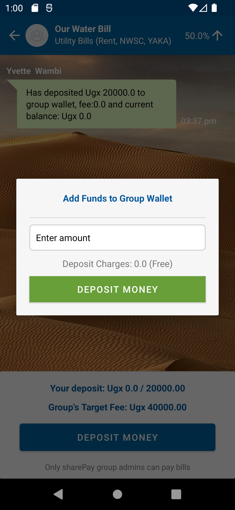

# Project Title and Description

- **Project Title**: SharePay: Simplifying Expenses Together
- **Description**: Managing shared expenses among groups of people is often a complex and cumbersome process. Whether it's friends planning a trip, roommates sharing living costs, or colleagues collaborating on a project, coordinating contributions, tracking expenses, and settling payments can lead to confusion, disputes, and inefficiencies. There is a lack of a unified platform that simplifies the process of collecting funds, tracking expenses, and settling payments within a group.

## Table of Contents

- [Installation](#installation)
- [Usage](#usage)
- [Features](#features)
- [Screenshots/GIFs](#screenshotsgifs)
- [Acknowledgments](#acknowledgments)
- [Authors](#authors)

## Installation

To use this Android Studio project, follow these steps:

1. **Clone the Repository**: Start by cloning this repository to your local machine using Git. Open a terminal and run the following command:

2. **Open the Project in Android Studio**:

- Launch Android Studio on your computer.
- Choose "Open an existing Android Studio project" from the welcome screen.
- Navigate to the directory where you cloned the repository and select the project's root folder.

3. **Configure Your Environment**:

- Ensure you have the necessary Android SDK components installed. Android Studio will prompt you to install any missing components.
- Make sure you have Java Development Kit (JDK) installed on your system. Android Studio requires JDK.

4. **Build and Run**:

- Build the project by clicking the "Build" button in Android Studio.
- Connect an Android device to your computer or use an Android emulator.
- Run the app on your device or emulator by clicking the "Run" button in Android Studio.

5. **Explore and Test**:

- Once the app is running, explore its features and test its functionality.

That's it! You now have the SharePay app up and running in Android Studio.

## Usage

### Adapters

The project contains several adapters to handle different aspects of the application's functionality:

- **GroupMemberAdapter**: This adapter handles the display of group members. 

- **GroupRequestAdapter**: This adapter is responsible for handling group requests. 

- **GroupsAdapter**: The `GroupsAdapter` manages the display of groups within the app. 

- **MessageAdapter**: The `MessageAdapter` is used for displaying messages within the app. 


### Model

The `Model` package contains classes that represent essential data structures within the application:

- **Groups**: The `Groups` class defines the structure for group wallet data. 

- **Messages**: The `Messages` class represents message data. 

- **User**: The `User` class encapsulates user data. 


## MTN MoMo API Product

- **Collections | Enable remote collection of bills, fees or taxes.**
Collections is a service that enables Mobile Money partners to receive payments for goods and services using MTN Mobile Money. The services can be face-to-face like MomoPay or can be done remotely for both offline and online. Payments can be customer-initiated on USSD/App/Web or Merchant-initiated where a customer is sent a debit request for approval.

### Sandbox_User

The `Sandbox_User` package offers several functions for MTN MoMo API management and security:

- **createUser**: The `createUser` class is responsible for creating user accounts. It interacts with MTN's API for user creation.

Here's a snippet of code demonstrating how to use the `createUser` class:

```java
try {
    // Define your API credentials and UUID
    String PRIMARY_KEY = "your_api_subscription_key";
    String CONTENT_TYPE = "application/json";
    String UUID = "your_unique_user_identifier";

    // Call the userCreation method to create a user
    int responseCode = createUser.userCreation(PRIMARY_KEY, CONTENT_TYPE, UUID);

    if (responseCode == 201) {
        System.out.println("User creation successful!");
    } else {
        System.out.println("User creation failed. Response code: " + responseCode);
    }
} catch (IOException | JSONException e) {
    e.printStackTrace();
}
```

- **getToken**: The `getToken` class is responsible for obtaining an authentication token. 

Here's an example of how to use the `getToken` class:

```java
try {
    // Define your API subscription key and authentication key
    String PRIMARY_KEY = "your_api_subscription_key";
    String AUTH_KEY = "your_base64_encoded_authentication_key";

    // Call the theToken method to obtain the authentication token
    String token = getToken.theToken(PRIMARY_KEY, AUTH_KEY);

    if (token equals "UnAuthorized") {
        System.out.println("Authentication failed. Check your credentials.");
    } else if (token equals "INTERNAL_SERVER_ERROR") {
        System.out.println("Internal server error. Please try again later.");
    } else if (token equals "ERROR") {
        System.println("An error occurred while obtaining the token.");
    } else {
        System.out.println("Authentication successful. Access Token: " + token);
    }
} catch (IOException | JSONException e) {
    e.printStackTrace();
}
```

- **getUserApiKey**: The `getUserApiKey` class is responsible for obtaining the API key associated with a user account.

Here's an example of how to use the `getUserApiKey` class:

```java
try {
    // Define your API subscription key, content type, and user's UUID
    String PRIMARY_KEY = "your_api_subscription_key";
    String CONTENT_TYPE = "application/json";
    String UUID = "user_uuid";

    // Create an instance of the getUserApiKey class
    getUserApiKey apiKeyGetter = new getUserApiKey();

    // Call the userApiKey method to obtain the API key
    String apiKey = apiKeyGetter.userApiKey(PRIMARY_KEY, CONTENT_TYPE, UUID);

    if (!apiKey.isEmpty()) {
        System.out.println("API Key obtained successfully: " + apiKey);
    } else {
        System.out.println("Failed to obtain API Key.");
    }
} catch (IOException | JSONException e) {
    e.printStackTrace();
}
```

### Collection Classes

The collection classes play a vital role in managing Payment collections within the application:

- **getRequestToPayStatus**: The `getRequestToPayStatus` class is responsible for retrieving the status of a request to pay from MTN's API.

Here's an example of how to use the `getRequestToPayStatus` class:

```java
try {
    // Define your API subscription key, content type, target environment, UUID, and user token
    String PRIMARY_KEY = "your_api_subscription_key";
    String CONTENT_TYPE = "application/json";
    String TARGET_ENVIRONMENT = "sandbox";
    String UUID = "request_to_pay_uuid";
    String USER_TOKEN = "user_access_token";

    // Call the getStatus method to retrieve the request to pay status
    String statusDetails = getRequestToPayStatus.getStatus(PRIMARY_KEY, CONTENT_TYPE, TARGET_ENVIRONMENT, UUID, USER_TOKEN);

    System.out.println("Request to Pay Status Details: ");
    System.out.println("------------------------------");
    System.out.println(statusDetails);
    System.out.println("------------------------------");
} catch (IOException | JSONException e) {
    e.printStackTrace();
}
```

- **getUserInformation**: The `getUserInformation` class is responsible for retrieving information about a user account from MTN's API.

Here's an example of how to use the `getUserInformation` class:

```java
try {
    // Define your API subscription key, content type, and user's UUID
    String PRIMARY_KEY = "your_api_subscription_key";
    String CONTENT_TYPE = "application/json";
    String UUID = "user_uuid";

    // Call the userInformation method to retrieve user information
    String targetEnvironment = getUserInformation.userInformation(PRIMARY_KEY, CONTENT_TYPE, UUID);

    System.out.println("User Information Details: ");
    System.out.println("------------------------------");
    System.out.println("Target Environment: " + targetEnvironment);
    System.out.println("------------------------------");
} catch (IOException | JSONException e) {
    e.printStackTrace();
}
```

- **requestToPay**: The `requestToPay` class is responsible for initiating a request to pay within MTN's API. This process involves sending payment details and instructions to MTN for processing.

Here's an example of how to use the `requestToPay` class:

```java
try {
    // Define your API subscription key, content type, user's UUID, user token, target environment, amount, and phone number
    String PRIMARY_KEY = "your_api_subscription_key";
    String CONTENT_TYPE = "application/json";
    String UUID = "user_uuid";
    String USER_TOKEN = "user_access_token";
    String TARGET_ENVIRONMENT = "sandbox";
    String AMOUNT = "1000"; // The amount to be paid
    String PHONE = "recipient_phone_number";

    // Call the getRequestToPay method to initiate the request to pay
    int responseCode = requestToPay.getRequestToPay(PRIMARY_KEY, CONTENT_TYPE, UUID, USER_TOKEN, TARGET_ENVIRONMENT, AMOUNT, PHONE);

    System.out.println("Request to Pay Response Code: " + responseCode);
} catch (IOException | JSONException e) {
    e.printStackTrace();
}

```

## Key Features

SharePay offers a range of powerful features to simplify expense sharing and group financial management:

- **Expense Sharing**: Easily split and manage shared expenses within your groups.
- **Group Creation**: Create groups for various purposes like trips, roommates, or work projects.
- **Virtual Wallets**: Each group gets a virtual wallet to collect and manage contributions.
- **Expense Tracking**: Log expenses with descriptions, dates, and amounts for transparency.
- **Contribution Calculation**: Automated calculation of each member share based on predefined rules or percentages.
- **Expense Allocation**: Input shared bills, break down amounts, and allocate them to group members.
- **Contributions Pooling**: Funds contributed by members are pooled in the group wallet for easy expense settlement.
- **Payment Initiation**: Initiate payments from the group wallet to external services or merchants.
- **Transaction Records**: Keep detailed transaction records for transparency and accountability.
- **Secure Transactions**: Integrates with MTN Mobile Money API for secure and convenient fund collection and payment processing.
- **Use Cases**: Versatile usage in friend groups, roommates, family budgeting, work projects, student expenses, and event planning.
- **Transparency**: Easily track contributions, payments, and balances with transparent financial records.
- **Simplified Payment Process**: Streamline expense settlement with consolidated contributions within the group wallet.
- **Continuous Improvement**: Regular updates based on user feedback and feature enhancements.
- **Cross-Platform Support**: Available on Android with plans for an iOS version.
- **Marketing and Expansion**: Expanding reach through marketing and strategic partnerships.
- **Feature Enhancements**: Future support for international currencies, expense analytics, budget planning, and receipt scanning.
- **Scaling Infrastructure**: Prepared to scale to accommodate increased user traffic and ensure a smooth user experience.

## SharePay Demostration

Here are some screenshots of SharePay in action:

| Main Screen | Profile Screen | Create New Group | Add Members to Group | Members accept/decline group requests |
|:---:|:---:|:---:|:---:|:---:|
|  |  |  |  |  |

| Group Wallet | Deposit funds to wallet | Deposit successful | Pay for the service (YAKA) | Receive Payment Message |
|:---:|:---:|:---:|:---:|:---:|
|  |  |  |  |  |

Watch the SharePay demonstration on YouTube:

<a href="https://www.youtube.com/watch?v=UO8u9WEZSx8" style="text-decoration:none;background-color:#FF0000;color:#FFFFFF;padding:10px 20px;border-radius:5px;">Watch Video</a>

## Acknowledgments

We extend our sincere appreciation to MTN for providing the MTN Mobile Money API, which plays a crucial role in the functionality of SharePay. Their API has enabled us to create a seamless and secure platform for expense sharing and group financial management. We are grateful for their support and the opportunities it has brought to our project.

## Authors

- [Kiirya Arnold](https://github.com/arnoldkiirya1) - Backend development.
- [Wambi Yvette Nerima](https://github.com/yvettewambi/) - Frontend development (UX, UI).
- [Amanya Brian](https://github.com/Amanya-Brian) - MTN MoMO API Java client development and testing.

## Maintainers

- [Kiirya Arnold](https://github.com/arnoldkiirya1) - Maintainer for Backend development.
- [Wambi Yvette Nerima](https://github.com/yvettewambi/) - Maintainer for Frontend development (UX, UI).
- [Amanya Brian](https://github.com/Amanya-Brian) - Maintainer for MTN MoMO API Java client development and testing.

